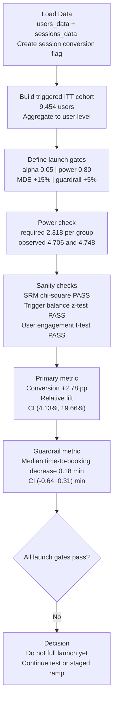

# A/B Test Analysis: Search Ranking Algorithm Rollout

Production-style A/B testing project that answers one question: **should we launch a new ranking algorithm to 100% of traffic?**

## Workflow

## Key Results
| Area | Result | Interpretation |
|---|---:|---|
| Triggered users | 9,454 / 10,000 (94.54%) | Strong analysis coverage |
| Required sample size | 2,318 per group | Power requirement met |
| Observed sample size | 4,706 control / 4,748 variant | Well-powered for target MDE |
| SRM check | p-value=0.8572 | No assignment imbalance |
| Trigger-rate balance | p-value=0.2715 | No funnel-entry bias |
| Sessions/user balance | p-value=0.5321 | No engagement imbalance |
| Conversion lift (absolute) | +2.78 pp, 95% CI [1.03, 4.53] pp | Statistically significant improvement |
| Conversion lift (relative) | +11.58%, 95% CI [4.13%, 19.66%] | CI overlaps +15% MDE threshold |
| Guardrail (median time-to-booking) | -0.18 min, 95% CI [-0.64, 0.31] min, p-value=0.4129 | No meaningful degradation |

## Overview
- Built an end-to-end experiment analysis from raw session/user logs to launch recommendation.
- Evaluated **10,000 randomized users** and **15,283 triggered sessions**.
- Found statistically significant conversion improvement: **+2.78 pp** (control 23.99% -> variant 26.77%, p-value=0.0019).
- Found guardrail safety on booking friction: median time-to-booking delta **-0.18 min** (95% CI: [-0.64, 0.31] min).
- Final decision: **do not full-launch yet** under strict practical-significance gates; continue test or staged ramp.

## Business Question
Should the company launch the new search ranking algorithm to all users, given both upside (conversion) and risk (time to booking)?

## Data
- `users_data.csv`: randomized assignment (`control` vs `variant`) for 10,000 logged-in users.
- `sessions_data.csv`: session-level behavior and booking evidence.
- Analysis population: triggered intention-to-treat users (randomized users with >=1 session).

## Experiment Design
- Randomization unit: user.
- Primary metric: user conversion rate.
- Guardrail metric: median time to booking among converters.
- Confidence level: 95% (`alpha=0.05`).
- Power target: 80%.
- Primary practical threshold (MDE): +15% relative lift.

## Methodology
- Constructed session-level conversion signal from booking fields.
- Aggregated to user level to align with user-level randomization.
- Ran power analysis for minimum required sample size per arm.
- Performed experiment quality checks:
  - Sample Ratio Mismatch (SRM) chi-square test.
  - Trigger-rate balance test (two-proportion z-test).
  - Sessions-per-user balance test (Welch's t-test).
- Primary inference:
  - Two-proportion z-test for conversion.
  - 95% CI for absolute lift.
  - Bootstrap CI for relative lift.
- Guardrail inference:
  - Mann-Whitney U test.
  - Bootstrap CI for median time-to-booking delta.
  - Non-inferiority decision against pre-defined tolerance.

## Launch Recommendation
**Decision: Hold full rollout for now.**

Rationale:
- Statistical significance is achieved on the primary metric.
- Guardrail non-inferiority is satisfied.
- However, practical-significance gate is not fully satisfied because relative-lift uncertainty overlaps the +15% business MDE.

Recommended next step: continue running the experiment (or stage a gradual ramp) to tighten confidence intervals and confirm lift clears the practical threshold.